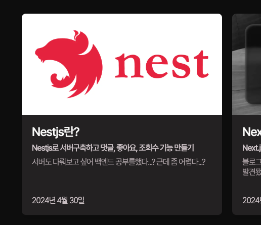

블로그 포스팅 카드를 만들고 나니 화질이 흐린 것을 뒤늦게
눈치챘다. <br /> 바로 고쳐보자..!

## 1. 문제상황

### a. Next/Image를 사용한 Image

<center>
  
</center>

요즘말로 **'혼자 그림체가 다르다...'**  
아래의 텍스트들은 당연하게도 선명한데  
이미지는 흐리멍덩한게 클릭 안하고 싶게 생겼다.

### b. 나의 Next/Image Component 코드

```js
<Image
  alt="post-image"
  src={src}
  priority
  width={200}
  height={200}
  className="h-[200px] w-full rounded-t-lg"
/>
```

props에 src경로가 있을 경우에 즉 썸네일 이미지를 지정해줄 경우에는  
Image컴포넌트를 사용하고
그게 아닌 경우에 어두운 배경화면만 있는 div를 렌더링한다.

<Callout type="danger">
  ❗️Next-Image 컴포넌트는 width와 height를
  지정해줘야한다
</Callout>

**하지만!**  
width를 지정해주면 height는 auto로 최적화되고  
이 상태에서 height props를 아무렇게나 변경해도 변화가없으며 width에 맞춰 렌더링된다.

**여기서 내 실수**는 props width는 200으로 지정해놓고  
className으로 w-full을 줬다.

width와 height props를 설정안해주면 오류가 나기때문에  
대충 지정한 후에 className으로 스타일링을 덮어씌웠던 것이다.

간단하면서도 적합한 해결방안이 있다.

## 2. 해결방안

### a. Image를 감싸는 컨테이너를 만들고 fill props이용하기

```js
<div className="relative h-[200px] w-full">
  <Image
    alt="post-image"
    src={src}
    priority
    sizes="100%"
    fill
    className="h-[200px] w-full rounded-t-lg"
  />
</div>
```

핵심은 fill props인데  
상위 컨테이너로 한번 감싼 후에 relative 속성을 걸어주고  
하위 이미지에서 width, height props는 지우자  
(fill props를 쓸 경우 width, height props는 없어도 된다)

fill을 true로 설정해주고 sizes도 100%로 맞춰준 다음  
이후에 className으로 스타일링 해주면 콘솔 warning도 없고 깔끔하게 마무리된다.

<center>
  
</center>

위 사진이랑 비교했을 때 엄청 선명해졌다.

## 3. fill은 이런 경우에 사용하세요.

nextjs14 공식문서에서는  
**width와 height를 알 수 없는 다이나믹한 이미지에 fill**을 사용하라고 권장한다.  
https://nextjs.org/docs/app/api-reference/components/image#fill

또한 **sizes props와 같이 사용한다.**  
fill만 사용할 경우 sizes까지 포함하라는 경고문을 보게 될 것이다.
